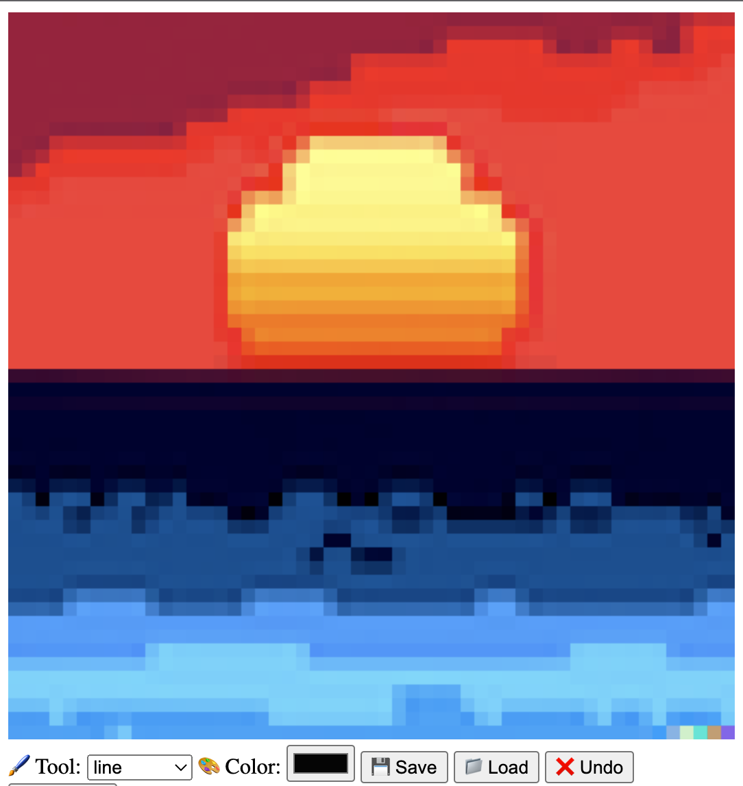

### A repo for projects and algorithms from
#  [Eloquent JavaScript](https://eloquentjavascript.net/)

## Project Highlights

<table><tbody><tr><td>

### Pixel Art Editor
- [Click to see video](https://twitter.com/CalebtheWood/status/1573384018569183233)
- [Click to see the source code](https://github.com/calebthewood/eloquentJS/blob/main/ch17-Game/scripts/game.js)

</td><td>

### Platform Game
- [Click to see video](https://twitter.com/CalebtheWood/status/1571228695385481216)
- [Click to see the source code](https://github.com/calebthewood/eloquentJS/blob/main/ch19-PixelArtEditor/index.js)

</td></tr></tbody></table>

# Chapter Summaries
I completed chapters 1-4 before starting this repository. My notes and work are lost to the hd of an old laptop, but I like revisiting this book from time to time so who knows, I might add them to the repo the next time I brush up on my fundamentals.

## Part 1: Language
1. Values, Types, and Operators
- Review on fundamental concepts: Booleans, Logical Operators, Unary Operators, short-circuiting, etc.
2. Program Structure
- Detailed reading on Expressions, Statements, Bindings, Control Flow, Conditional Execution, Loops, Naming, Comments, etc.
3. Functions
- Defining, Binding, Scope, Functions as Values, Arrow Fns, Call Stack, Optional Arguments, Closures, Recursion, Constructors, and Side Effects.
4. Data Structures: Objects and Arrays
- All about how to work with a data set. In this chapter I manipulated arrays and objects to analyze a Squirrel's diary, and determine what foods caused him to transform into a wherewolf. Covered topics like the rest operator, Math object, Destructuring, and JSON.
5. Higher-order Functions
- In this chapter I worked with unicode library to do some interesting things with strings. Covered topics like filtering, transforming, and reducing arrays, composability, character codes, and basic statistics.
6. The Secret Life of Objects
- Covered the basics on Javascript's Prototypal Inheritance, Classes, Derived Properties, Maps, Polymorphism, Symbols, Iterators, Getters, Setters, and Statics, and Instances
7. Project: A Robot
- My first time traversing a graph! This was one of the big 'Aha!' moments for me in my programming journey. In this chapter I built different graph traversal algorithms to power a robotic mailman for a small town.  Topics including Persisting Data, Pathfinding, and Animation.
8. Bugs and Errors
- Covers concepts and best practices for things like Strict Mode, Type Errors, Testing, Debugging, Error Propagation, Exceptions, Try-Catch Blocks, Assertions, and Error Handling.
9. Regular Expressions
- I had been avoiding RegEx for a full year by the time I hit this chapter, but I actually had a lot of fun learning how to construct different RegEx's myself. Learned about Matches, Groups, the Date class, mechanics of Matching, Backtracking, Replacing, Greed, Dynamic RegEx's, File Parsing, and various JS methods.
10. Modules
- In this chapter I learned about ES6 modules, npm Packages, CommonJS modules, Building, Bundling, and Dependencies.
11. Asynchronous Programming
- In this chapter I learned about Threading, Multithreading, Synchronous/Asynchronous code, Networks, Network Flooding, Network Failure, Message Routing, ES6 Async-Await, Callbacks, Promises, Generators, the Event Loop, and common async bugs.
12. Project: A Programming Language
- This chapter takes a deep dive and walks you through building a custom programming language. It walks through the basics of Parsing, Evaluating, Environments, Functions, and Compilation. It's one that benefits from multiple passes!
## Part 2: Browser
13. JavaScript and the Browser
- This chapter covers the browser wars, the development of the internet, and basically why the web is the way it is. It explains HTML, JSON, Browser Compatability, and the sandboxed nature of the browser.
14. The Document Object Model
- In this chapter I covered the DOM structure, Trees more generally, standards, finding nodes, changing the DOM, Attributes, Layout, Styling, CSS, Query Selectors, Positioning, Animating. This is the first part of the book where you start building what could be called a website.
15. Handling Events
- Here I learned all about using Javascript to handle events and add a level of interactivity. Topics included: Event Object, Propagation, Default Behaviors, Key Events, Pointer Events, Touch Events, Scroll Events, Focus Events, Load Events, Timers, the Event Loop, and Debouncing.
16. Project: A Platform Game
- The shockingly intricate process of making a 2D platform game in the browser. I took a primarily Object Oriented approach to coding this. I wrote classes for the player, the level itself, game state, lava, monsters, coins, a vector class to handle movement. There were functions for drawing the level based on a string input, and a very simple motion and collision system. This was tough, but I loved every minute of it.
17. Drawing on Canvas
- This chapter covered the Canvas element and drawing in 2D. It covered all the basics including Paths, Curves, Arcs, Text, Images, Transformations, and provided an intro to other tools like SVG and plain HTML. By the end I had even drawn new art for the last chapter's game.
18. HTTP and Forms
- This chapter returned to web and browser fundamentals such as HTTP, TCP, IP, Fetching, CORS, Security, HTTPS, Form Fields, Focus, Disabled Fields, File Fields, and Client-Side Storage.
19. Project: A Pixel Art Editor
- This chapter provided another big project that builds on all the perevious experience. A Pixel Art Editor. By the end of the chapter I had built an editor capable for drawing lines and shapes in different colors. It can also save images, load images, edit images, and had a basic 'undo' feature. I even built in hotkeys!
## Part 3: Node
20. Node.js
- This chapter covers Javascript in the Node environment. It revisits npm and Packages, versioning, File System module, HTTP module, Streams, File Servers, and some command line basics. #grep
21. Project: Skill-Sharing Website
I haven't done the last chapter yet, but I intend to! By the time I finished the book, I'd built several big fullstack websites as a part of my full stack bootcamp and the skills seemed redundant as I entered the job search. I do love the author's detailed style and thougtful examples so I plan on coming back to 100% it.
