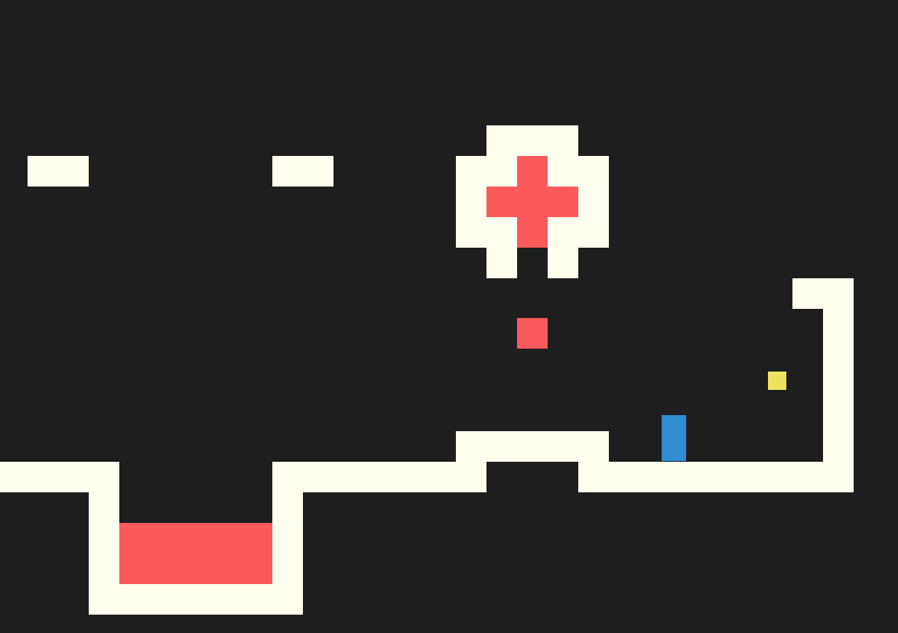
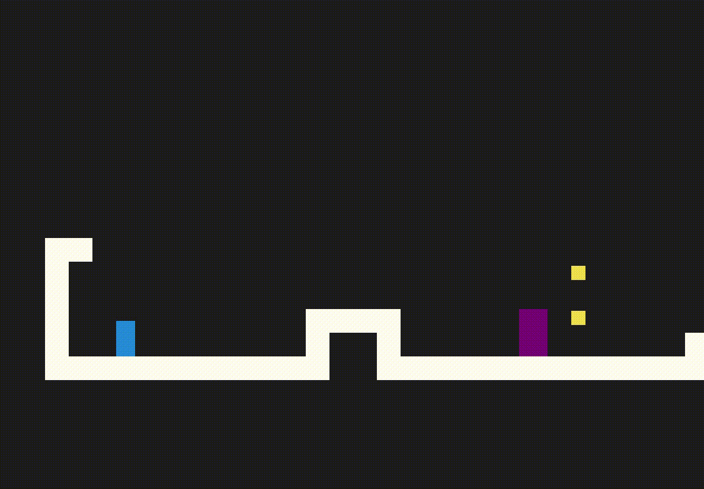

<div id="top"></div>

# Building a Platform Game in JavaScript

> “All reality is a game.” - *Iain Banks, The Player of Games*
>





<!-- TABLE OF CONTENTS -->
<br>
<br>
  <summary>Table of Contents</summary>
  <ol>
    <li>
      <a href="#about-the-project">About The Project</a>
      <ul>
        <li><a href="#built-with">Built With</a></li>
      </ul>
    </li>
    <li>
      <a href="#how-to-play">How to Play</a>
    </li>
    <li><a href="#level-template">Level Template</a></li>
    <li><a href="#holding-state">Holding State</a></li>
    <li><a href="#handling-actors">Handling Actors</a></li>
    <li><a href="#drawing-the-game">Drawing the Game</a></li>
    <li><a href="#handling-movement">Handling Movement</a></li>
    <li><a href="#updating-actors">Updating Actors</a></li>
    <li><a href="#adding-a-monster">Adding a Monster</a></li>
    <li><a href="#roadmap">Roadmap</a></li>
  </ol>
<br>


## About

The main goal of this project is to get deep into the JavaScript and DOM APIs, while also having a bit of fun. Much of this comes from chapter 16 of Marijn Haverbeke’s Eloquent JavaScript, which is itself based on the game [Dark Blue](https://www.lessmilk.com/dark-blue/). I'll continue iterating on it, and see where it takes me.

The game is drawn and rendered in the DOM, not the most performant for more complex games, but totally fine for something like this. I'm also planning to shift to using canvas, although I expect to spin out a new repo when I get to that point, and leave this as is, divs and all.
<br>
## Built With

* [JavaScript](https://www.javascript.com/)
* [HTML & CSS](https://html.spec.whatwg.org/)
<br>

## How to Play



*the above gif moves much slower than the game*

The player is controlled using event listeners on the arrows and/or ‘wasd’ keydowns. Player takes out baddies by jumping on their heads. The game is won when all coins are collected, or lost if the user touches lava or a monster.

The rest of this ReadMe is dedicated to walking through the implementation.
<br>

## Level Template

Level templates are strings where each character corresponds to a type of block we’ll render and interact with. We’ll ingest this string to create the corresponding DOM elements. Think of it as a blueprint for the actual level that will be constructed.

“.” is empty space,

“#” is wall,

“+” is lava,

“@” is player,

“=” is scrolling lava,

“|” is dripping lava, and

“o” is coins.

```jsx
let simpleLevelPlan = `
......................
..#................#..
..#..............=.#..
..#.........o.o....#..
..#.@......#####...#..
..#####............#..
......#++++++++++++#..
......##############..
......................`;
```
<br>

## Reading a Template

We’ll be using classes to handle most of the various elements of the game. This allows us to preserve some state regarding the current game, and encapsulate the functionality for each aspect.

The level class starts by constructing a level instance from a new template string or ‘plan’. W edo quite a bit in one line: `trim()` ensures all lines begin with a newline. `split()` then creates rows, and we use `map()` and the spread operator to break each row into an array of characters. You may be familiar with creating 2d boards with nested `for` loops, but this method leverages the newer ES6 methods to cut down our lines of code considerably.

With the game board built we can get our dimensions for height and width, we’ll use these often., and we set an array for actors. Actors will be the dynamic pieces like the player, scrolling lava, and the coins; basically anything animated.

Now buckle up because this next part gets wild. At this point we can map through our existing rows variable, and then map through each element. This will allow us to build a board where each element contains the “type” of DOM element it will be. If the element contains an “actor” then we’ll insert a new Vec instance. If you’re getting confused at this point, don’t worry! We haven’t written Vec or types yet.

```jsx
class Level {
  constructor(plan) {
    let rows = plan.trim().split("\n").map(l => [...l]);
    this.height = rows.length;
    this.width = rows[0].length;
    this.startActors = [];

    this.rows = rows.map((row, y) => {
      return row.map((ch,x) => {
        let type = levelChars[ch];
        if (typeof type == "string") return type;
        this.startActors.push(
          type.create(new Vec(x, y), ch));
        return "empty;"
      });
    });
  }
}
```
<br>

## Holding State

No React `useState()` here! This is, after all, vanilla JS. We’ll use a state class, aptly named State, to keep track of actors as they move and disappear. It will hold the current level, the actors, and game status: win, lose, ongoing. This class will be reinstantiated more or less constantly during an active game with no side effects. A new state object is created each time, leaving the previous one intact.

```jsx
class State {
  constructor(level, actors, status) {
    this.level = level;
    this.actors = actors;
    this.status = status;
  }
  static start(level) {
    return new State(level, level.startActors, "playing");
  }

  get player() {
    return this.actors.find(a => a.type == "player");
  }
}
```
<br>

## Handling Actors

The Vec class is small but mighty! As you can tell from the name, short for vector, it will hold information on the actors’ position, size, and movement.

```jsx
class Vec {
  constructor(x, y) {
    this.x = x;
    this.y = y;
  }
  plus(other) {
    return new Vec(this.x + other.x, this.y + other.y);
  }
  times(factor) {
    return new Vec(this.x * factor, this.y * factor);
  }
}
```

Each actor will need a class to handle their own behavior. In this game that just means position, speed, and size, but you could start to imagine something like ‘hp’ could go here too. The speed property will be how we simulate momentum and gravity.  What’s going on with player size you ask? Good question! Keen eye, I like it! the player will always, always be the same size. What this means is we can save a little bit of work by storing it on the prototype. This means all players will be 0.8 wide and 1.5 tall, no need to recreate that every time we need to evaluate a players size. In a game, we might be evaluating the player’s state 60x per second so small efficiencies will add up quickly. Additionally, if we stored size as a Class property, it would still be possible to modify it each time we instantiate a new Player.

```jsx
class Player {
  constructor(pos, speed) {
    this.pos = pos;
    this.speed = speed;
  }
  get type() { return "player"; }

  static create(pos) {
    return new Player(pos.plus(new Vec(0, -0.5)), new Vec(0, 0));
  }
}

Player.prototype.size = new Vec(0.8, 1.5);
```

Lava! Remember we have 3 types of lava. Two of them have movement associated so we’ll give the class a speed property and a reset property. Reset will be used for “dripping” lava.

```jsx
class Lava {
  constructor(pos, speed, reset) {
    this.pos = pos;
    this.speed = speed;
    this.reset = reset;
  }

  get type() { return "lava"; }

  static create(pos, ch) {
    if (ch == "=") {
      return new Lava(pos, new Vec(2, 0));
    } else if (ch == "|") {
      return new Lava(pos, new Vec(0, 2));
    } else if (ch == "v") {
      return new Lava(pos, new Vec(0, 3), pos);
    }
  }
}

Lava.prototype.size = new Vec(1, 1);
```

I know, I know, you probably see Math.PI in there and you’re freaking out a little. Don’t worry, we’re using Math’s PI and random to generate a natural looking movement for our coins. The movement is stored in the wobble property. Without Math.random() our coins would all spin in sync, and probably distract a bit from the actual gameplay. Alternatively you could use the Math.sin to create a wave pattern.

```jsx
class Coin {
  constructor(pos, basePos, Wobble) {
    this.pos = pos;
    this.basePos = basePos;
    this.wobble = wobble;
  }

  get type() { return "coin"; }

  static create(pos) {
    let basePos = pos.plus(new Vec(0.2,0.1));
    return new Coin(basePos, basePos,
                    Math.random() * Math.PI * 2)
  }
}

Coin.prototype.size = new Vec(0.6, 0.6);
```
<br>

## Drawing the Game

Here we define the legend/key for reading our level blueprint. Also place a helpful console log to check our dimensions.

```jsx
const levelChars = {
  ".": "empty",
  "#": "wall",
  "+": "lava",
  "@": Player,
  "o": Coin,
  "=": Lava,
  "|": Lava,
  "v": Lava,
}
```

‘elt’ here is short for element. This will allow us to draw a single dom element, and give it some attributes that will come in handy soon.

```jsx
function elt(name, attrs, ...children) {
  let dom = document.createElement(name);
  for (let attr of Object.keys(attrs)) {
    dom.setAttribute(attr, attrs[attr]);
  }
  for (let child of children) {
    dom.appendChild(child);
  }
  return dom;
}
```


I believe this will be the parent node to the entire level. We’ll write drawGrid shortly…

```jsx
class DOMDisplay {
  constructor(parent, level) {
    this.dom = elt("div", { class: "game" }, drawGrid(level));
    this.actorLayer = null;
    parent.appendChild(this.dom);
  }

  clear() { this.dom.remove(); }
}
```

Here we set the scale. I’m hoping to be able to scale this dynamically based on viewport dimensions. Then we begin drawing our level. This function does quite a lot in a small amount of space. We’re passing elt “table” to create the background and overall structure of our level. Then we give in an object of attributes, class and style. Then we pass in the children, our whole grid. This is the third time we’ve encountered this nested map() pattern so hopefully it’s not so scary now. If it helps, just imagine this as two nested for loops. We could do this that way, but it would take up more space, there would be more semicolons, and an i and a j, honestly ES6 is just much nicer to look at and code.

```jsx
const scale = 20;

function drawGrid(level) {
  return elt("table", {
    class: "background",
    style: `width: ${level.width * scale}px`
  }, ...level.rows.map(row =>
    elt("tr", { style: `height: ${scale}px` },
      ...row.map(type => elt("td", { class: type })))
  ));
}
```

Time to add some css! I’ll be playing with this extensively to give our game a little facelift.

```css
.background {
  background: rgb(52, 166, 251);
  table-layout: fixed;
  border-spacing: 0;
}

.background td {
  padding: 0;
}

.lava {
  background: rgb(255, 100, 100);
}

.wall {
  background: white;
}
```

This function will draw our actors, the parts of our game with movement or behavior.  We’re essentially creating a rectangle. Remember drawing in JavaScript is relative to the top left corner of the screen so we’ll set dimensions for our object’s size, and it’s position relative to `left` and `top`

```jsx
function drawActors(actors) {
  return elt("div", {}, ...actors.map(actor => {
    let rect = elt("div", {class: `actor ${actor.type}`});
    rect.style.width = `${actor.size.x * scale}px`;
    rect.style.height = `${actor.size.y * scale}px`;
    rect.style.left = `${actor.pos.x * scale}px`;
    rect.style.top = `${actor.pos.y * scale}px`;
    return rect;
  }))
}
```

And some css for our actors. Comment on absolute position.

```css
.actor {
  position: absolute;
}
.coin {
  background: rgb(241, 229, 89);
}
.player {
  background: rgb(64, 64, 64);
}
```

Next we’ll add the process for redrawing an actor. We could maintain the same dom element for an actor and move it throughout the level, but this would require an additional framework for tracking location. It is much simpler to remove and redraw the actor as state changes. Important to note that here we are choosing simplicity over performance, but in a simple game we’re not missing out on much.

```jsx
DOMDisplay.prototype.syncState = function(state) {
  if (this.actorLayer) this.actorLayer.remove();
  this.actorLayer = drawActors(state.actors);
  this.dom.appendChild(this.actorLayer);
  this.dom.className = `game ${state.status}`;
  this.scrollPlayerIntoView(state);
};
```

Here’s some css to style the player for win or loss, and some more to help style our game board. Dive into details on this.

```jsx
.lost .player {
  background: rgb(160, 64, 64);
}
.won .player {
  box-shadow: -4px -7px 8px white, 4px -7px 8px white;
}

.game {
  overflow: hidden;
  max-width: 600px;
  max-height: 450px;
  position: relative;
}
```

Here we have a brilliant piece of work to keep our player within a bubble roughly in the center of the screen. You could imagine how it would be a bit jarring to have the screen follow his movement 1:1 so instead we allow for a margin of space in the center of the screen before scrolling to recenter. It occurs to me that this aspect of considering the viewport is totally absent from the type of backend work I’ve been doing lately.

```jsx
DOMDisplay.prototype.scrollPlayerIntoView = function (state) {
  let width = this.dom.clientWidth;
  let height = this.dom.clientHeight;
  let margin = width / 3;

  //the viewport
  let left = this.dom.scrollLeft;
  let right = left + width;
  let top = thius.dom.scrollTop;
  let bottom = top + height;

  let player = state.player;
  let center = player.pos.plus(player.size.times(0.5))
    .times(scale);

  if (center.x < left + margin) {
    this.dom.scrollLeft = center.x = margin;
  } else if (center.x > right - margin) {
    this.dom.scrollLeft = center.x + margin - width;
  }
  if (center.y < top + margin) {
    this.dom.scrollTop = center.y - margin;
  } else if (center.y > bottom - margin) {
    this.dom.scrollTop = center.y + margin - height;
  }
};
```

Initiate a new level.

```jsx
let simpleLevel = new Level(simpleLevelPlan);
let display = new DOMDisplay(document.body, simpleLevel);
display.syncState(State.start(simpleLevel));
```
<br>

## Handling Movement

Motion and collision is a huge topic, there’s sophisticated methods for modeling how to move a player through an environment, we’re not doing that here. Before moving the actor, we’ll check to see if the next movement is valid (it doesn’t take us into a wall), if valid we’ll move there, if not then the move gets cancelled.

This function will tell us whether an element is touching a wall or outside the level.

```jsx
Level.prototype.touches = function(pos, size, type) {
  let xStart = Math.floor(pos.x);
  let xEnd = Math.ceil(pos.x + size.x);
  let yStart = Math.floor(pos.y);
  let yEnd = Math.ceil(pos.y + size.y);

  for (let y = yStart; y < yEnd; y++) {
    for (let x = xStart; x < xEnd; x++) {
      let isOutside = x < 0 || x >= this.width ||
                      y < 0 || y >= this.height;
      let here = isOutside ? "wall" : this.rows[y][x];
      if (here == type) return true;
    }
  }
  return false;
}
```

Checks to see if we’ve collided with a wall or lava

```jsx
State.prototype.update = function (time, keys) {
  let actors = this.actors
    .map(actor => actor.update(time, this, keys));
  let newState = new State(this.level, actors, this.status);

  if (newState.status != "playing") return newState;

  let player = newState.player;
  if (this.level.touches(player.pos, player.size, "lava")) {
    return new State(this.level, actors, "lost");
  }

  for (let actor of actors) {
    if (actor != player && overlap(actor, player)) {
      newState = actor.collide(newState);
    }
  }
  return newState;
};
```

To detect overlaps we check both the x and y of two actors and return a boolean

```jsx
function overlap(actor1, actor2) {
  return (
    actor1.pos.x + actor1.size.x > actor2.pos.x &&
    actor1.posx < actor2.pos.x + actor2.size.x &&
    actor1.pos.y + actor1.size.y > actor2.pos.y &&
    actor1.pos.y < actor2.pos.y + actor2.size.y);
}
```

Handling collisions

```jsx
Lava.prototype.collide = function(state) {
  return new State(state.level, state.actors, "lost");
}

Coin.prototype.collide = function(state) {
  let filtered = state.actors.filter(a => a != this);
  let status = state.status;
  if (!filtered.some(a => a.type == "coin")) status = "won";
  return new State(state.level, filtered, status);
};
```
<br>

## Updating Actors

This is where we’ll check to see if our lava is making a valid move.

```jsx
Lava.prototype.update = function (time, state) {
  let newPos = this.pos.plus(this.speed.times(time));
  if (!state.level.touches(newPos, this.size, "wall")) {
    return new Lava(newPos, this.speed, this.reset);
  } else if (this.reset) {
    return new Lava(this.reset, this.speed, this.reset);
  } else {
    return new Lava(this.pos, this.speed.times(-1));
  }
};
```

Coin

```jsx
const wobbleSpeed = 8;
const wobbleDist = 0.07;

Coin.prototype.update = function(time) {
  let wobble = this.wobble + time * wobbleSpeed;
  let wobblePos = Math.sin(wobble) * wobbleDist;
  return new Coin(this.basePos.plus(new Vec(0, wobblePos)),
                  this.basePos, wobble);
};
```

Player

horizontal and vertical collisions are handled apart from one another. This ensures that a vertical collision doesn’t impact horizontal speed and vice versa.

```jsx
const playerXSpeed = 7;
const gravity = 30;
const jumpSpeed = 17;

Player.prototype.update = function (time, state, keys) {
  let xSpeed = 0;
  if (keys.ArrowLeft) xSpeed -= playerXSpeed;
  if (keys.ArrowRight) xSpeed += playerXSpeed;
  let pos = this.pos;
  let movedX = pos.plus(new Vec(xSpeed * time, 0));
  if (!state.level.touches(movedX, this.size, "wall")) {
    pos = movedX;
  }

  let ySpeed = this.speed.y + time * gravity;
  let movedY = pos.plus(new Vec(0, ySpeed * time));
  if (!state.level.touches(movedY, this.size, "wall")) {
    pos = movedY;
  } else if (keys.ArrowUp && ySpeed > 0) {
    ySpeed = -jumpSpeed;
  } else {
    ySpeed = 0;
  }
  return new Player(pos, new Vec(xSpeed, ySpeed));
};
```

```jsx
function trackKeys(keys) {
  let down = Object.create(null);
  function track(event) {
    if (keys.includes(event.key)) {
      down[event.key] = event.type == "keydown";
      event.preventDefault();
    }
  }
  window.addEventListener("keydown", track);
  window.addEventListener("keyup", track);
  return down;
}

const arrowKeys = trackKeys(["ArrowLeft", "ArrowRight", "ArrowUp"]);
```

```jsx
function runAnimation(frameFunc) {
  let lastTime = null;
  function frame(time) {
    if (lastTime != null) {
      let timeStep = Math.min(time - lastTime, 100) / 1000;
      if (frameFunc(timeStep) === false) return;
    }
    lastTime = time;
    requestAnimationFrame(frame);
  }
  requestAnimationFrame(frame)
}
```
<br>

## Adding a Monster

In the monster’s function we grab the player currently in state, we’ll be using the player state to inform the monster’s movement. In the ternary if the plater has a lower x coordinate, ie: to the left of the monster, then we’ll decrement the monster’s x, otherwise we increment (move right). This is fine for now, but later we would want to make the monster’s movement more sophisticated. Perhaps by giving it one behavior while the player is out of range, and another behavior once the player has approached the monster. Currently when our monster hits a wall, it stays put. I would like to borrow the lava behavior, to maybe give our monster some back and forth movement.
<br>

**Updating Monster**

```jsx
update(time, state) {
        let player = state.player;
        let speed = (player.pos.x < this.pos.x ? -1 : 1) * time * monsterSpeed;
        let newPos = new Vec(this.pos.x + speed, this.pos.y);
        if (state.level.touches(newPos, this.size, "wall")) return this;
        else return new Monster(newPos);
      }
```

Once again, we’ll grab the player. Currently the monster can only handle collisions with a vertical wall, and with the player. If the monster collides with a player we check to see if the the bottom of the player is close to the top of the monster, if so then we filter the monster out from the list of actors currently in state. If not, then the player has met and unfortunate end, and we update the State status to lost.
<br>

**Handling Collisions**

```jsx
collide(state) {
        let player = state.player;
        if (player.pos.y + player.size.y < this.pos.y + 0.5) {
          let filtered = state.actors.filter(a => a != this);
          return new State(state.level, filtered, state.status);
        } else {
          return new State(state.level, state.actors, "lost");
        }
      }
    }
```
<br>

## Roadmap

Plans for future features and fixes
1. Updated monster behavior. They now only move towards the player once you come within a certain viscinity
2. Pause feature
  - basic pause added, press 'esc'
  - pause text needed
3. Lives
 - basic lives implemented
 - display needed
4. Additional monster behaviors
5. Pixel art, if time allows...
6. Some parts of the guide need more explanation